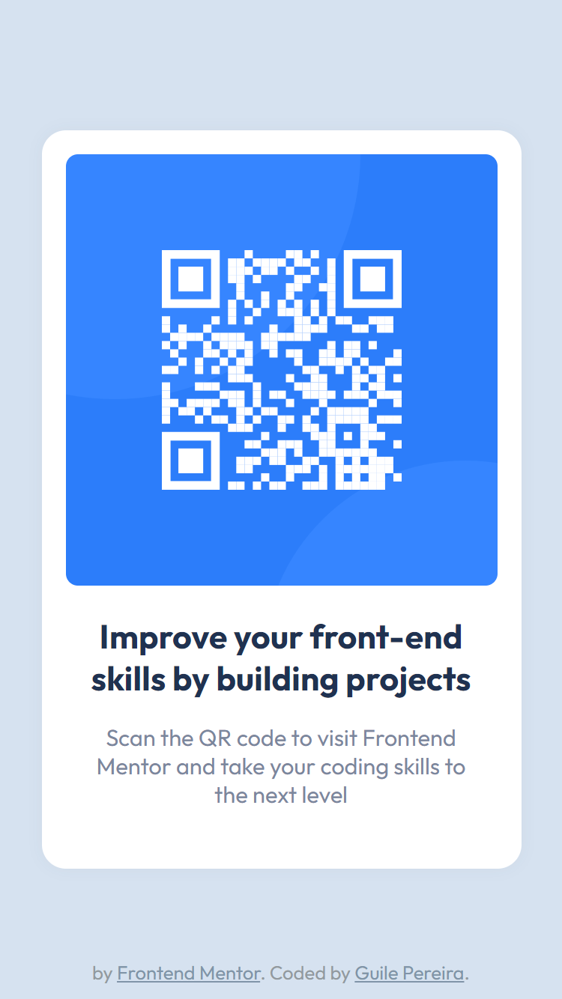
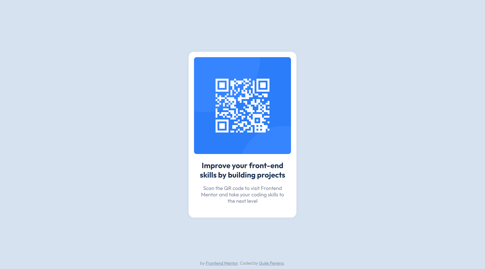

# Frontend Mentor - QR code component solution

This is a solution to the [QR code component challenge on Frontend Mentor](https://www.frontendmentor.io/challenges/qr-code-component-iux_sIO_H). Frontend Mentor challenges help you improve your coding skills by building realistic projects.

## Table of contents

- [Overview](#overview)
  - [Screenshot](#screenshot)
  - [Links](#links)
- [My process](#my-process)
  - [Built with](#built-with)
  - [What I learned](#what-i-learned)
- [Author](#author)

## Overview

### Screenshot
|        Mobile          |                   Desktop                |
|------------------------|------------------------------------------|
|||

### Links

- Live project on [GitHub](https://guilepereira.github.io/html-css/qr-code-component-main/)

- Solution on [Frontend Mentor](https://www.frontendmentor.io/solutions/qrcode-component-mobile-first-gmqSoxxt60)

-------

## My process

I started this exercise as a standard practice, trying to recognize the structure of HTML to achieve the desired result. When observing the proposed layout, I realized that it would be an ideal opportunity to use the Mobile First methodology and put into practice some initial learnings about accessibility.

At the beginning of the process, I had difficulty starting the project through the mobile interface, considering the change in dimensions I was used to. However, I returned to observe the project and focused on understanding the demands. This was one of the lessons that this project provided me.

The approach to accessibility occurred naturally in this opportunity, in which, since I understood the importance, I try to apply it to the fullest in my studies and I was quite happy with the result. I know that I still have a lot to explore in this direction and I will continue to study!

### Built with

- Semantic HTML5 markup;
- CSS custom properties;
- Mobile First;
- Accessibility.

### What I learned

In this project I was able to put into practice knowledge about mobile first, understanding its contrast with the methods I knew until then. As a technique, I gained insights into new ways to apply my knowledge.

## Author

- LinkedIn - [Guile Pereira](https://www.linkedin.com/in/guilevpereira/)
- GitHub - [Guile Pereira](https://github.com/guilepereira)
- Frontend Mentor - [@guilepereira](https://www.frontendmentor.io/profile/guilepereira)

